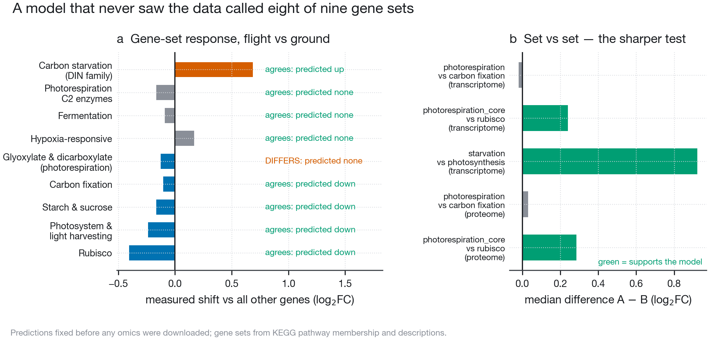

# A gas-transport model predicts the *Arabidopsis* spaceflight transcriptome

**A sealed, illuminated growth canister has its CO₂ consumed by the plants inside it, within
minutes. That happens in the ground control as much as in flight — so it does not bias the
flight-versus-ground contrast, it changes what that contrast is about. The spaceflight
response is being measured in plants their own hardware has already carbon-starved.**

[**Interactive model and data explorer**](https://dr-richard-barker.github.io/Photorespiration_multiomics_microgravity/)
· [manuscript PDF](https://dr-richard-barker.github.io/Photorespiration_multiomics_microgravity/Photorespiration_multiomics_microgravity.pdf)
· [figures](results/figures) · [tables](results/tables)



---

## What this is

A validated lattice-Boltzmann model of leaf boundary-layer gas transport
([LunarLeaf-CFD](https://github.com/dr-richard-barker/LunarLeaf-CFD)) coupled to a
Farquhar–von Caemmerer–Berry model of C₃ photosynthesis, used to ask what spaceflight
*growth hardware* — not gravity — does to the CO₂ reaching Rubisco. The predictions were
fixed before any omics were downloaded, then tested against NASA OSDR.

### The four findings

1. **A lit sealed canister is a CO₂-starvation chamber.** 400 ppm to near zero in about
   seven minutes; 12 h carbon gain at **1 %** of an unenclosed control, against 90 % under
   micropore tape and 100 % when vented.
2. **That effect is ~25× the microgravity effect, and invisible.** Because the drawdown is a
   mass balance it happens in the ground control too, so it subtracts out of
   flight-versus-ground.
3. **Our own starting hypothesis was wrong.** We expected CO₂ starvation to *amplify* the
   microgravity boundary-layer penalty. It converges instead: with no assimilation there is
   no flux across the boundary layer for gravity to impede. What survives is a persistent
   5–9 % assimilation deficit.
4. **The model predicted the measurement.** Blind, it called **eight of nine** gene-set
   responses in OSD-522. In PaintOmics, photosynthesis pathways were enriched and
   photorespiration ranked **last of all 231** pathways tested.

### And what did not work

- **The predicted enclosure gradient does not hold** (Spearman ρ = −0.50, *p* = 0.67). Sealed
  and vented fall the right way round but micropore tape sits highest, and three studies
  cannot rank three classes. What *does* separate the six studies is **illumination**, which
  is mechanistically what the model says — drawdown requires photosynthesis to be running.
- **The strongest signal in the data is one this model does not explain**: protein processing
  in the endoplasmic reticulum, *p* = 8.6 × 10⁻⁹, the unfolded protein response.
- **OSDR has no plant metabolome.** Of 567 studies, six are metabolite profiling and every
  one is mouse, human, rat or microbial; **0 of 66 plant studies**. The third omic layer had
  to be predicted, and is labelled as model output everywhere it appears.

---

## Layout

```
data/                 inputs only
  study_registry.tsv    which OSDR studies enter, the exact contrast column, and why
  lunarleaf/            vendored CFD tables + provenance
  mapman/               vendored MapMan diagrams + gene-to-bin mapping + provenance
  paintomics_upload/    the validated submission bundle
  cache/                OSDR + KEGG downloads (git-ignored, regenerated on demand)
scripts/              every executable, numbered in pipeline order
  fvcb.py               the model core, importable
  genesets.py           KEGG-derived gene sets, shared by both analyses
  mapman.py             MapMan pathway membership, rebuilt from the diagram layouts
  figures/              one script per figure + the shared visual system
  run_all.sh            regenerates everything from a cold cache
results/tables/       T01…T12 + MANIFEST.tsv (fails if a table lacks provenance)
results/figures/      eight figures, PNG at 300 dpi and PDF vector
manuscript/latex/     npj Microgravity style, compiles locally and in CI
methods/              prose methods and the honest caveats
docs/                 the interactive site
```

### Reproducing

```bash
bash scripts/run_all.sh
```

Needs network on a cold cache. `python3 scripts/check_js_parity.py` then confirms the
browser model still agrees with the Python (currently **exact**, 0.000e+00 across 180
parameter combinations).

The MapMan inputs under `data/mapman/` are vendored rather than fetched, because
MapManStore's own published links are already dead and the diagrams are reachable only one
portlet query at a time. `python3 scripts/mapman.py --fetch` refreshes all 14 files or none;
`run_all.sh` deliberately does not, since the pathway universe is an enrichment denominator.

PaintOmics submission is deliberately separate, because it uploads to a third-party server:

```bash
python3 scripts/05_submit_paintomics.py --job 1
```

---

## Progress

| Phase | Status |
|---|---|
| Model coupling (CFD → FvCB) | **done** — six physical self-checks pass |
| Predicted metabolite layer | **done** — 21 compounds, KEGG ids from the REST API |
| OSD-522 transcriptome + proteome | **done** — PyDESeq2, 1,795 DE genes; 5,160 proteins |
| Blind falsification test | **done** — 8 of 9 gene sets |
| PaintOmics integration | **done** — jobs `m1z16Qg3DK` and `EVFahRGk7T` |
| Cross-study ladder (6 studies) | **done** — illumination separates; enclosure gradient does not |
| Eight-figure set | **done** |
| npj manuscript | **compiles** — 12 pages, no unresolved references; author block is placeholders |
| Interactive site | **done** — model, enclosures, omics (volcano, heatmap, Sankey), pathways, six studies |
| FAIR packaging | **done** — manifest, CITATION.cff, .zenodo.json, MIT |
| Zenodo deposit | **pending** — needs the author fields below |

### What still needs a human

Nothing here was invented to fill a gap, so these remain visibly open:

- **Author block.** Co-authors, affiliation, ORCIDs, funding, contributions —
  see the checklist in [`manuscript/latex/README.md`](manuscript/latex/README.md).
- **Zenodo DOI**, then paste it into the manuscript's Data and Code availability sections.
- **A framing decision — partly settled.** The title now claims the mechanism (photosynthesis
  depletes its own enclosure) and its consequence (the response is read out in carbon-starved
  plants), rather than an enclosure gradient the data did not support. Still worth your call:
  whether to lead instead with the blind-prediction result, which is the safest claim here.
- **The ER / unfolded-protein-response result** currently gets one paragraph. It is the
  largest signal in the data and this model says nothing about it.

### Where it could go next

- **In-canister CO₂ and O₂ logging.** The cheapest and highest-value change: it converts this
  analysis's central assumption into a measurement, and makes an entire archive of
  BRIC-derived transcriptomes reinterpretable.
- **A ~20-compound targeted metabolite panel on archived flight material** — it would be the
  first plant spaceflight metabolome in existence, and
  [`results/tables/T06_predicted_compounds.tsv`](results/tables/T06_predicted_compounds.tsv)
  is a ready-made target list with a quantitative prediction attached to each compound.
- **A three-arm design** (flight sealed, ground sealed, ground vented). Two arms confound
  hardware with gravity; three separate them, and the third arm never leaves the ground.
- **More studies**, if the tissue constraint can be relaxed defensibly — the ladder is
  currently three lit and three dark, which is too few to rank enclosure classes.

Full reasoning in [`FUTURE_EXPERIMENTS.md`](FUTURE_EXPERIMENTS.md).

---

## Honesty notes

This project has a few standing rules, and they are load-bearing:

- **The metabolite layer is model output and says so** in every file, figure and page that
  shows it.
- **Study selection is auditable.** [`data/study_registry.tsv`](data/study_registry.tsv)
  records each inclusion and each exclusion with its reason. Tissue is the binding
  constraint: root studies are excluded because a photosynthesis prediction says nothing
  about roots.
- **Contrasts are matched.** OSD-678 offers 36 flight-versus-ground contrasts but only six
  are matched on genotype, ecotype and light; the rest compare flown Col-0 against
  ground-control *phyD*.
- **Gene sets come from KEGG, not memory.** An earlier hand-written list here put PGLP1 at
  the wrong locus, and *Arabidopsis* reuses the symbols CAT2 and SEN1 for unrelated genes.
- **MapMan membership is a reconstruction and is labelled as one.** PaintOmics publishes
  enrichment results but not the gene lists behind them, and MapMan has no REST API, so the
  13 MapMan pathways are rebuilt from the diagram layouts by PaintOmics' own rules. It
  matches PaintOmics' feature count exactly or within three for 9 of the 13 and runs larger
  for the four whole-ontology overview maps; the site shows both numbers on every node
  rather than picking one, and
  [`data/mapman/PROVENANCE.md`](data/mapman/PROVENANCE.md) says what is not recoverable.
- **References were verified against the publisher record**, never recalled.
- **A sibling CFD repository is deliberately not used.** See
  [`methods/CFD_PROVENANCE_CONCERN.md`](methods/CFD_PROVENANCE_CONCERN.md).
- **The metabolite class-activity test is close to circular** and is reported as such; the
  hub analysis is not, and is the one to read.

## Data sources

NASA Open Science Data Repository — OSD-522 (BRIC-LED-001), OSD-38 (BRIC-20),
OSD-321 (BRIC-22), OSD-678 (CARA), OSD-427 (APEX-04/VEGGIE).
Gas transport from LunarLeaf-CFD. Pathway enrichment from KEGG and MapMan via PaintOmics;
KEGG membership from the KEGG REST API, MapMan membership rebuilt from GoMapMan's gene
mapping and the MapManStore diagram layouts (see
[`data/mapman/PROVENANCE.md`](data/mapman/PROVENANCE.md)).

## Licence

MIT — see [LICENSE](LICENSE).
