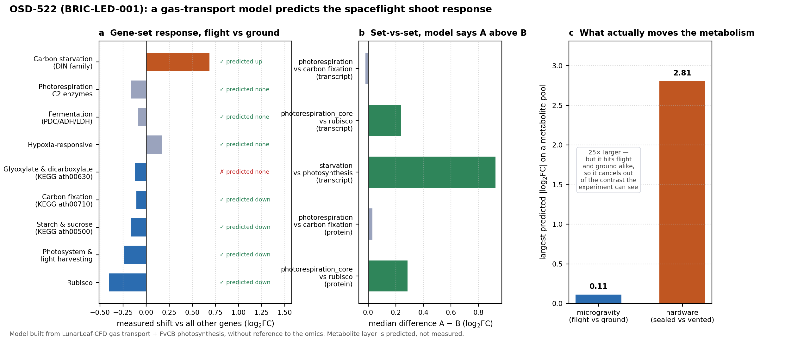

# Photorespiration multi-omics — microgravity

The subcellular photorespiration model that sits **inside the leaf**, downstream of the
gravity-dependent gas transport solved **outside the leaf** by
[LunarLeaf-CFD](https://github.com/dr-richard-barker/LunarLeaf-CFD), and upstream of the
transcriptomic / metabolic response reviewed in
[Hypoxia_vs_elevated_CO2_in_spaceflight](https://github.com/dr-richard-barker/Hypoxia_vs_elevated_CO2_in_spaceflight).

Photorespiration is the missing middle between those two: it is governed by the O₂/CO₂ ratio
*at Rubisco*, and that ratio is set by a chain of conductances whose top link — the leaf
boundary layer — is exactly what LunarLeaf-CFD computes as a function of gravity.

```
Bulk air Ca ──[ g_bl : gravity-dependent, from LunarLeaf-CFD ]──▶ leaf surface Cs
   Cs ──[ g_s stomata ]──▶ intercellular Ci ──[ g_m mesophyll ]──▶ chloroplast Cc, O₂
                          │
                          ▼   Rubisco carboxylation vs oxygenation (Vo/Vc = 2Γ*/Cc)
        CHLOROPLAST → PEROXISOME → MITOCHONDRION   (the C2 photorespiratory cycle)
                          │
                          ▼   transcriptomic + metabolic signature (OSD-38 / CO2_RNAseq)
```

## What is here now — `fvcb.py`

`fvcb.py` is the first component: an **FvCB oxygenation calculator**. It takes the
gravity-dependent boundary-layer conductance `g_bl(g)` reported by LunarLeaf-CFD, pushes it
through the `Ca → Cs → Ci → Cc` conductance chain, and solves the supply = demand operating
point of a Farquhar–von Caemmerer–Berry C3 model **with the Rubisco oxygenation term made
explicit** — so the output is the photorespiratory quantities, not just net assimilation:

| symbol | meaning |
|---|---|
| `Cc` | CO₂ mole fraction reaching Rubisco (chloroplast stroma) |
| `Vo/Vc` | oxygenation : carboxylation ratio = `2Γ*/Cc` |
| `phi` | oxygenation fraction `Vo/(Vc+Vo)` |
| `Rp` | photorespiratory CO₂ release = `0.5·Vo` (µmol m⁻² s⁻¹) |
| `Rp/A` | photorespiration relative to net assimilation |

Run it:

```bash
python3 fvcb.py                       # uses the vendored CFD snapshot in data/
python3 fvcb.py --csv path/to/export.csv   # or point at a fresh LunarLeaf-CFD export
```

It prints the gravity-sweep table, writes `photorespiration_vs_gravity.csv`, and runs physical
self-checks (Γ*, φ range, monotonic trends). No dependencies beyond the Python standard library.

### The CFD → FvCB interface (a CSV)

The gravity/geometry sweep is **read from a CSV that LunarLeaf-CFD exports**, not hard-coded. Its
`validation/export_cfd.ts` writes `results/tables/T13_boundary_layer.csv`; a snapshot is vendored
here as [`data/lunarleaf_gbl_sweep.csv`](data/lunarleaf_gbl_sweep.csv). Required columns:

| column | meaning |
|---|---|
| `scenario`, `scale` | e.g. `leaf-ug`, `canopy` |
| `gravity_g` | gravity (m s⁻²); 9.81 = Earth, 0 = µg |
| `g_bl_mol_m2_s` | boundary-layer conductance to CO₂ (the coupling variable) |
| `o2_excess_ppm` | CFD leaf-surface O₂ build-up (raises Γ\* at Rubisco) |
| `delta_mm`, `Sherwood` | optional; carried through for display/provenance |

To refresh after re-running the CFD: `cp …/LunarLeaf-CFD/results/tables/T13_boundary_layer.csv data/lunarleaf_gbl_sweep.csv`.

### Result (default parameters: Ca 400 µmol/mol, 25 °C, Q 1000, g_s 0.20, g_m 0.30 mol m⁻² s⁻¹)

| scale | g | g_bl | Cc | φ (%) | A | Rp/A (%) |
|---|---|---|---|---|---|---|
| leaf | Earth | 1.000 | 239 | 26.4 | 17.3 | 23.5 |
| leaf | Mars | 0.847 | 237 | 26.5 | 17.1 | 23.7 |
| leaf | Moon | 0.719 | 235 | 26.7 | 17.0 | 24.0 |
| leaf | micro-g | 0.494 | 229 | 27.2 | 16.5 | 24.8 |
| rosette | micro-g | 0.291 | 217 | 28.3 | 15.6 | 26.7 |
| canopy | micro-g | 0.109 | 180 | 32.2 | 12.6 | 34.4 |

**Reading it honestly:** at the **single-leaf** scale the boundary-layer effect on
photorespiration is real but *modest* (Rp/A 23.5 → 24.8 % from 1 g to µg), because the boundary
layer is a minority of the total CO₂ diffusion resistance (`1/g_bl` vs the larger `1/g_s + 1/g_m`).
The effect becomes **substantial in a dense microgreen canopy in microgravity** (`g_bl` collapses to
0.109, Cc falls to 180 µmol/mol, Rp/A rises to 34.4 %) — matching LunarLeaf-CFD's finding that the
gas-transport penalty amplifies leaf → rosette → canopy.

## Provenance and assumptions (no fabrication)

- **Rubisco kinetics + temperature responses** — in-vivo values of Bernacchi et al. (2001)
  *Plant Cell Environ.* 24:253–259 (Kc25 404.9, Ko25 278.4 mmol/mol, Γ\*25 42.75 µmol/mol) with
  their Arrhenius activation energies; Jmax response from Bernacchi et al. (2003).
- **`g_bl(g)`** — the converged boundary-layer conductance reported by LunarLeaf-CFD
  (README / `results/tables/T2`), anchored so the Earth single leaf = 1.0 mol m⁻² s⁻¹. The CFD
  surface O₂ excess (T5) is fed in too; at leaf scale it is small (a few µmol/mol on 210 000) so
  the coupling is Cc-dominated — stated rather than hidden.
- **Placeholders, not fits** — `Vcmax25`, `Jmax25`, `Rd25`, `g_s`, `g_m` are mid-range Arabidopsis
  literature values exposed as `LeafParams`. They are not fitted to spaceflight data yet.

## The multi-omics test — OSD-522 (BRIC-LED-001)

The model above is now closed against real spaceflight data, and tested with PaintOmics.



**The dataset.** OSD-522, *Integrative Transcriptomics and Proteomics Profiling of
Arabidopsis thaliana*, BRIC-LED hardware on SpaceX-13/14 — Arabidopsis seedling shoots,
6 Space Flight vs 6 Ground Control, with both a transcriptome and a proteome.

**The missing layer.** NASA OSDR has no plant metabolomics. All 567 OSDR studies were pulled
through the search API and cross-tabulated: 6 are metabolite profiling, and every one is
mouse, human, rat or microbial. **None of the 66 plant studies has a metabolome.** So the
third omic layer is predicted from the CFD → FvCB chain — labelled `PREDICTED` everywhere,
and used as a *falsifiable hypothesis* rather than as a substitute for data. See
[`metabolome/PREDICTION_METHOD.md`](metabolome/PREDICTION_METHOD.md).

**The result we did not expect.** We assumed CO₂ starvation in a sealed canister would
*amplify* the microgravity boundary-layer penalty. It does the opposite: as assimilation
falls toward the compensation point the flux through the boundary layer falls with it, so
`A/g_bl` tends to zero and the two gravities converge on oxygenation fraction. What survives
is a persistent ~5–9 % assimilation penalty, nearly independent of canister CO₂.

Meanwhile the **enclosure** effect is 25× the gravity effect — but it acts on flight and
ground alike, so it cancels out of the contrast the experiment can see. The plants were
carbon-starved by their hardware, in both arms, and the experiment was structurally blind
to it.

**The model predicted the data.** Built from gas transport and photosynthesis alone, with no
sight of the omics, it called eight of nine gene-set responses correctly — photosystem,
Rubisco, carbon fixation and starch/sucrose down; carbon-starvation (DIN) markers up
(+0.71, p = 2.6e-3); photorespiratory enzymes *not* induced; no fermentation or hypoxia. The
sharpest test, photorespiration sitting above Rubisco, holds in the transcriptome
(+0.24, p = 6.8e-3) and independently in the proteome (+0.29, p = 0.049).

### Running it

```bash
python3 osdr/fetch_osd522.py          # 4 processed files from OSDR into osdr/cache/
python3 osdr/dge_rnaseq.py            # PyDESeq2 flight vs ground -> 1,795 DE genes
python3 osdr/prep_proteomics.py       # deposited S/G ratios, SOL+MEM reconciled
python3 metabolome/predict_metabolome.py --sensitivity
python3 osdr/falsification_check.py   # the real test — can refute the model
python3 paintomics/validate_upload.py
python3 results/plot_falsification.py
```

| Where | What |
|---|---|
| [`paintomics/upload/`](paintomics/upload) | the validated PaintOmics input bundle |
| [`paintomics/SUBMISSION.md`](paintomics/SUBMISSION.md) | how to run the job, and what leaves this machine |
| [`metabolome/compound_provenance.tsv`](metabolome/compound_provenance.tsv) | 21 compounds, KEGG IDs from `rest.kegg.jp`, driver and tier per row |
| [`results/falsification_check.tsv`](results/falsification_check.tsv) | prediction vs measurement, both layers |
| [`FUTURE_EXPERIMENTS.md`](FUTURE_EXPERIMENTS.md) | what this implies for future flights |
| [`results/CFD_PROVENANCE_CONCERN.md`](results/CFD_PROVENANCE_CONCERN.md) | why `spaceflight-plant-hardware-cfd` was not used |

## Next steps

1. ~~Ingest a LunarLeaf-CFD CSV export directly instead of a hard-coded table.~~ **Done** — see
   *The CFD → FvCB interface* above.
2. Make `g_s` CO₂-/humidity-responsive and couple `g_m` — currently fixed (the same limitation
   LunarLeaf-CFD flags for its own feedback loop). BRIC canisters are humid, so this matters.
3. Feed the predicted photorespiratory flux into a compartmentalised (chloroplast → peroxisome →
   mitochondrion) flux model constrained by the OSD-38 / CO2_RNAseq transcriptomics
   (scFEA/FLUXestimator), closing the loop to the observed spaceflight signature.
4. Extend the same test to the hardware ladder OSDR already contains — BRIC-16/17/20/22,
   CARA (OSD-678), APEX/TAGES (OSD-7, OSD-16), VEG-05 (OSD-767) — which is the measurement
   the 25× hardware prediction really calls for.
