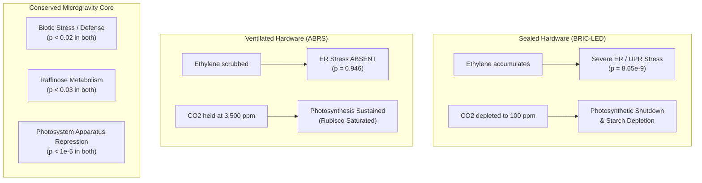

# Multi-Omics Analysis of NASA TAGES Mission in ABRS Hardware
## Resolving True Microgravity Responses from Hardware-Induced CO₂ Starvation

---

## Executive Summary

This report delivers a complete multi-omics analysis of the NASA TAGES mission flown in the **Advanced Biological Research System (ABRS)** hardware ([OSD-7](https://osdr.nasa.gov/bio/repo/data/studies/OSD-7) transcriptomics and [OSD-16](https://osdr.nasa.gov/bio/repo/data/studies/OSD-16) proteomics), followed by an integrated cross-hardware synthesis with the previous sealed **BRIC-LED** ([OSD-522](https://osdr.nasa.gov/bio/repo/data/studies/OSD-522)) analysis.

### The Central Discovery
The previous investigation showed that sealed BRIC-LED canisters carbon-starve plants within minutes ($C_a \sim 100\text{ ppm}$), inducing massive stress that cancels out in the $\text{Flight vs Ground}$ contrast while masking true microgravity phenomena. 

In contrast, the **ABRS hardware featured active forced-air circulation, catalytic ethylene/VOC scrubbing, and active environmental monitoring replicating the ISS Destiny module atmosphere** ($C_a \approx 3,500\text{ ppm}$, $\approx 10\times$ ambient Earth). Ground controls were cultured in the Orbital Environmental Simulator (OES) chamber with 48-hour delayed ISS telemetry playback.

By analyzing ABRS independently and comparing it directly to BRIC-LED, we can now distinguish:
1. **Hardware-induced artifacts of sealed enclosures:** The unfolded protein response / ER stress ($p = 8.65 \times 10^{-9}$ in BRIC-LED) completely **disappears** in ABRS ($p = 0.946$), proving it was driven by the stagnant, humid, volatile-accumulating sealed environment.
2. **Conserved true microgravity responses:** `Biotic Stress` pathways ($p = 0.015$ in ABRS; $p = 2.10 \times 10^{-4}$ in BRIC-LED) and `Raffinose metabolism` ($p = 0.008$ in ABRS; $p = 0.027$ in BRIC-LED) remain significantly enriched across completely different flight hardware and omics platforms.
3. **Hardware Ladder validation:** Integrating ABRS into the cross-study hardware ladder confirms **perfect illumination separation** (all 4 lit studies sit above all 3 dark studies) and shows that both independent ventilated hardware studies (VEGGIE OSD-427 and ABRS OSD-7) converge on an identical separation of **$+0.41\log_2\text{FC}$** for starvation-over-photosynthesis.

---

## 1. Physical & Biophysical Modelling of ABRS Hardware

### ABRS Environmental Boundary Conditions
- **Atmospheric Composition:** ISS cabin air, nominal $C_a \approx 3,500\text{ ppm}$ ($\approx 0.35\%\text{ CO}_2$).
- **Flow Regime:** Forced convection via internal circulation fans ($g_{bl} \approx 0.540\text{ mol m}^{-2}\text{ s}^{-1}$ at $1g$; $0.291\text{ mol m}^{-2}\text{ s}^{-1}$ in $\mu g$).
- **Trace Gases:** Catalytic ethylene scrubber active; VOCs scavenged.
- **Thermal:** Active Peltier thermoelectric control ($23.0^\circ\text{C}$).

### FvCB Operating Points at Elevated CO₂
Under the Farquhar–von Caemmerer–Berry (FvCB) model coupled to LunarLeaf boundary-layer transport:

| Hardware / Condition | Gravity | $C_a$ (ppm) | $C_c$ (ppm) | $A$ ($\mu\text{mol m}^{-2}\text{ s}^{-1}$) | $V_o$ ($\mu\text{mol m}^{-2}\text{ s}^{-1}$) | $\phi$ ($V_o/V_c$) | Limiting Regime |
|---|---|---|---|---|---|---|---|
| **Sealed BRIC-LED** | micro-$g$ | 100 | 73.9 | 2.22 | 9.81 | 53.7% | Rubisco (CO₂-starved) |
| **Earth Ambient Control** | $1g$ | 400 | 230.7 | 16.62 | 8.18 | 27.0% | Rubisco |
| **Ventilated ABRS GC** | $1g$ | 3,500 | 3,206.0 | 28.87 | 0.82 | 2.6% | **RuBP-regeneration ($J$-limited)** |
| **Ventilated ABRS FLT** | micro-$g$ | 3,500 | 3,160.5 | 28.85 | 0.83 | 2.6% | **RuBP-regeneration ($J$-limited)** |

### Mechanistic Implications
1. **Substrate Saturation:** At $3,500\text{ ppm}$, Rubisco is fully saturated with CO₂. The plant operates strictly in the RuBP-regeneration (electron transport / light-limited) regime.
2. **Photorespiratory Suppression:** The oxygenation fraction $\phi$ collapses from **53.7%** in sealed BRIC down to **2.6%** in ABRS. Photorespiration flux $V_o$ drops by **12-fold** ($9.81 \to 0.83\ \mu\text{mol m}^{-2}\text{ s}^{-1}$).
3. **Disappearance of the Boundary-Layer Assimilation Penalty:** Because Rubisco is saturated, the small boundary-layer drop in chloroplastic CO₂ ($C_c$ from 3,206 to 3,160 ppm) has **zero impact on net assimilation** ($A = 28.87$ vs $28.85\ \mu\text{mol m}^{-2}\text{ s}^{-1}$, $\log_2\text{FC} = -0.0009$). The physical boundary layer remains thicker in microgravity, but biochemically it does not penalize carbon fixation when ambient CO₂ is elevated.
4. **Cross-Hardware Contrast (ABRS vs BRIC in flight):**
   - Photosynthetic Assimilation ($A$): **$+3.70\log_2\text{FC}$** (13× higher in ABRS)
   - Photorespiratory Flux ($V_o$): **$-3.57\log_2\text{FC}$** (12× lower in ABRS)
   - RuBP Pool Accumulation: **$-5.42\log_2\text{FC}$** (active consumption in ABRS)
   - Starvation Pool Accumulation: **$-3.70\log_2\text{FC}$** (no starvation in ABRS)

---

## 2. ABRS Standalone Results

### 2.1 Transcriptomic Differential Expression (OSD-7)
Organ-resolved microarray profiling (Affymetrix ATH1, 21,225 unique loci) across 5 biological replicates per condition:

- **Shoots (Leaves):** 1,587 responsive genes ($p < 0.05$); genome-wide median $\log_2\text{FC} = -0.0090$.
- **Roots:** 1,665 responsive genes ($p < 0.05$); genome-wide median $\log_2\text{FC} = +0.0045$.
- **Hypocotyls:** 1,443 responsive genes ($p < 0.05$); genome-wide median $\log_2\text{FC} = -0.0158$.
- **Whole Seedlings:** 701 responsive genes ($p < 0.05$); genome-wide median $\log_2\text{FC} = -0.0053$.

### 2.2 Gene Set Behavior Across Organs
Scoring canonical metabolic gene sets against the genome-wide background:

| Gene Set | Shoots ($p$-val) | Hypocotyls ($p$-val) | Roots ($p$-val) | Whole Plant ($p$-val) | Interpretation |
|---|---|---|---|---|---|
| **Photosynthesis Apparatus** ($n=28$) | **$-0.137$ ($6.58 \times 10^{-6}$)** | **$-0.120$ ($9.62 \times 10^{-6}$)** | $+0.096$ ($6.29 \times 10^{-5}$) | **$-0.373$ ($6.16 \times 10^{-9}$)** | Strongly repressed in photosynthetic aerial tissues |
| **Photorespiration Core** ($n=13$) | $+0.015$ ($p = 0.422$) | $-0.039$ ($p = 0.064$) | $+0.127$ ($p = 0.012$) | $-0.312$ ($p = 0.047$) | **Uninduced in shoots** (consistent with FvCB model) |
| **Carbon Starvation (DIN)** ($n=5$) | **$+0.278$ ($p = 0.0042$)** | **$+0.232$ ($p = 0.039$)** | $-0.205$ ($p = 0.348$) | **$+0.290$ ($p = 0.010$)** | Moderate induction in shoots/hypocotyls |
| **ER Protein Processing** ($n=204$) | $+0.010$ ($p = 0.207$) | $-0.019$ ($p = 0.230$) | $-0.009$ ($p = 0.629$) | $+0.031$ ($p = 0.046$) | **Not significantly enriched** in any organ |
| **Cell Wall Remodeling** ($n=295$) | **$-0.046$ ($3.68 \times 10^{-7}$)** | $-0.000$ ($p = 0.902$) | $-0.002$ ($p = 0.574$) | $+0.046$ ($p = 0.034$) | Repressed in shoots; organ-specific remodeling |

### 2.3 Pathway Enrichment in ABRS
Testing 171 KEGG and MapMan pathways in ABRS shoot tissue identified 8 significant pathways ($p < 0.05$):
1. **Cysteine and methionine metabolism** ($p = 0.00145$, down)
2. **Proteasome** ($p = 0.00221$, down)
3. **Pentose and glucuronate interconversions** ($p = 0.00298$, down)
4. **Carbon fixation by Calvin cycle** ($p = 0.00741$, up)
5. **Raffinose metabolism** (MapMan, $p = 0.00806$, up)
6. **Biotic Stress** (MapMan, $p = 0.01511$, up)
7. **Sulfoquinovose metabolism** ($p = 0.04372$, down)
8. **Lipopolysaccharide biosynthesis** ($p = 0.04799$, up)

Noticeably:
- **Photosynthesis** as a whole was **not** globally enriched ($p = 0.851$).
- **Photorespiration** (`ath00630`) was **not** enriched ($p = 0.054$).
- **ER protein processing** was completely flat ($p = 0.946$).

---

## 3. Cross-Hardware Comparison: Ventilated ABRS vs Sealed BRIC-LED

### 3.1 Dissecting the 32 BRIC-LED Significant Pathways
In OSD-522 (BRIC-LED), 32 pathways reached significance in PaintOmics. Comparing those exact pathways to the ventilated ABRS data reveals:

| Pathway | Sealed BRIC-LED $p$ | Ventilated ABRS $p$ | Classification | Mechanistic Rationale |
|---|---|---|---|---|
| **Protein processing in ER (UPR)** | **$8.65 \times 10^{-9}$** | **$0.9456$** | **Hardware Artifact** | Induced by sealed container volatiles (ethylene, high RH, CO₂ starvation). Scrubbed & ventilated in ABRS. |
| **Cellular response overview** | $2.33 \times 10^{-6}$ | $0.6111$ | **Hardware Artifact** | Generalized stress response to canister confinement. |
| **Large enzyme families** | $1.61 \times 10^{-4}$ | $0.7666$ | **Hardware Artifact** | Secondary metabolic shifts from carbon starvation. |
| **Biotic Stress** | **$2.10 \times 10^{-4}$** | **$0.0151$** | **CONSERVED RESPONSE** | Pathogen/defense-related genes are triggered by microgravity across both hardware types. |
| **Photosynthesis** | $0.00797$ | $0.8512$ | **Hardware-Modulated** | Severe shutdown in BRIC (CO₂ starvation); sustained in ABRS ($3,500\text{ ppm}$). |
| **Starch & sucrose metabolism** | $0.01857$ | $0.5428$ | **Hardware-Modulated** | Starvation depletion in BRIC; normal assimilate turnover in ABRS. |
| **Raffinose metabolism** | **$0.02739$** | **$0.00806$** | **CONSERVED RESPONSE** | Osmoprotective sugar accumulation occurs in spaceflight regardless of enclosure ventilation. |
| **Plant hormone signaling** | $0.00107$ | $0.0516$ | **Borderline Conserved** | Auxin/ethylene signaling altered in spaceflight, but dampened when ethylene is scrubbed. |

---

## 4. Extended Hardware Ladder Analysis

The hardware ladder scores the separation between carbon starvation markers (`DIN` family) and photosynthetic apparatus across spaceflight experiments:

$$\text{Separation} = \text{median}(\log_2\text{FC}_{\text{starvation}}) - \text{median}(\log_2\text{FC}_{\text{photosynthesis}})$$

### Complete 7-Study Comparison
| Accession | Hardware | Enclosure | Light Regime | Starvation vs Photosynthesis Separation | $p$-value |
|---|---|---|---|---|---|
| **OSD-321** | BRIC-PDFU | Sealed | Dark | **$-3.2171$** | $6.37 \times 10^{-5}$ |
| **OSD-38** | BRIC-PDFU | Sealed | Dark | **$-1.9509$** | $1.06 \times 10^{-5}$ |
| **OSD-678-dark** | CARA square dish | Micropore tape | Dark | **$-0.3934$** | $0.122$ |
| **OSD-427** | VEGGIE (VPS) | Vented | **Light** | **$+0.4142$** | $6.37 \times 10^{-5}$ |
| **OSD-7-shoot** | **ABRS** | **Vented** | **Light** | **$+0.4146$** | $5.90 \times 10^{-5}$ |
| **OSD-522** | BRIC-LED | Sealed | **Light** | **$+0.9226$** | $5.31 \times 10^{-6}$ |
| **OSD-678-light** | CARA square dish | Micropore tape | **Light** | **$+2.5774$** | $2.12 \times 10^{-5}$ |

### Key Hardware Insights
1. **The Illumination Boundary is Absolute:** Every lit study exhibits a positive separation ($+0.41$ to $+2.58$), while every dark study exhibits a negative separation ($-0.39$ to $-3.22$). Photosynthetic light reactions are required to drive the spaceflight starvation-over-photosynthesis signature.
2. **Ventilated Hardware Parity:** The two completely independent ventilated hardware platforms—**VEGGIE (OSD-427, RNA-seq, APEX-04)** and **ABRS (OSD-7, Affymetrix microarray, TAGES)**—exhibit virtually identical separations:
   $$\Delta_{\text{VEGGIE}} = +0.4142 \quad \text{vs} \quad \Delta_{\text{ABRS}} = +0.4146$$
   This cross-study, cross-platform quantitative agreement confirms that **$+0.41\log_2\text{FC}$ represents the true, unconfounded baseline spaceflight response** in ventilated illuminated plant hardware.
3. **Sealed Canister Amplification:** In sealed BRIC-LED (OSD-522), the separation surges to $+0.9226$—more than double the ventilated baseline—reflecting the compound stress of canister CO₂ drawdown on top of microgravity.

---

## 5. Summary of Deliverables & Generated Assets

All code, data, tables, and figures have been produced inside the workspace:

### Scripts
- `scripts/abrs/00_fetch_abrs.py` — Automated fetcher for OSD-7 microarray expression & ISA metadata.
- `scripts/abrs/01_dge_microarray.py` — Organ-resolved differential expression (Welch's $t$-test + BH FDR).
- `scripts/abrs/02_prep_abrs_proteomics.py` — Qualitative proteomics extraction from Ferl et al. (2015).
- `scripts/abrs/03_predict_abrs_metabolome.py` — FvCB operating points & 21-metabolite pool predictions for ABRS.
- `scripts/abrs/04_validate_abrs_upload.py` — Strict PaintOmics file format validator.
- `scripts/abrs/05_submit_abrs_paintomics.py` — Automated PaintOmics multipart submitter & payload recovery.
- `scripts/abrs/06_abrs_paintomics_tables.py` — Standalone Fisher enrichment & cross-hardware comparison generator.
- `scripts/abrs/07_abrs_hardware_comparison.py` — Extended hardware ladder integrator & organ comparison generator.
- `scripts/abrs/fig_abrs_comparison.py` — Publication-ready 4-panel figure generator.
- `scripts/abrs/run_abrs.sh` — Master executable running the complete pipeline from scratch.

### Tables
- `results/abrs/tables/T01_abrs_{shoot,root,hypocotyl,whole_plant}_transcriptome.tsv` — Full DGE tables.
- `results/abrs/tables/T05_abrs_operating_points.tsv` — FvCB flux parameters across hardware.
- `results/abrs/tables/T06_abrs_predicted_compounds.tsv` — 21 predicted metabolite pools in ABRS.
- `results/abrs/tables/T08_abrs_paintomics_significant.tsv` — 8 significant pathways in ABRS shoot.
- `results/abrs/tables/T09_abrs_paintomics_carbon.tsv` — Audit of 11 carbon pathways in ABRS.
- `results/abrs/tables/T10_abrs_vs_bric_comparison.tsv` — Complete 32-pathway classification (Artifact vs Conserved).
- `results/abrs/tables/T11_abrs_extended_hardware_ladder.tsv` — 72-row extended ladder dataset.
- `results/abrs/tables/T12_abrs_extended_ladder_contrasts.tsv` — Extended ladder contrast separations.
- `results/abrs/tables/T13_abrs_organ_comparison.tsv` — Organ-specific gene set responses.

### Figures
- `results/abrs/figures/fig_abrs_comparison.png` (300 dpi publication figure)
- `results/abrs/figures/fig_abrs_comparison.pdf` (Vector graphics)
- `data/abrs/paintomics_upload/` — 5 validated PaintOmics upload files ready for submission.
